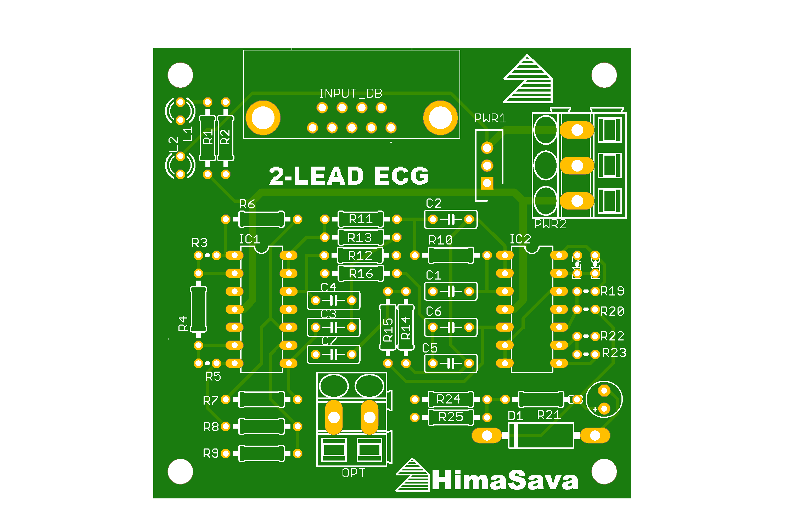
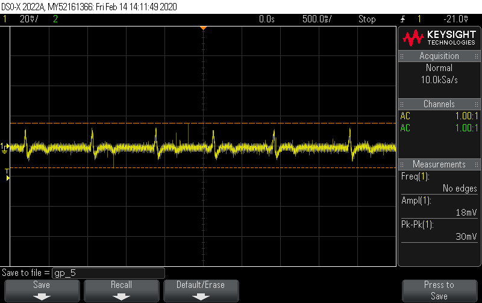

# Single_Lead_ECG_Machine

This project started as the project component for my subject analog electronic communcation that I took in my Winter Sem 2019.

The project uses 3 wires to be connected to the paitent as to aquire the ECG waveform from 2 of them and the third used as ground. The Circuit uses basic filteration techniques to get rid of the surrounding noise and amplify the signal to be effectively seen on a osciloscope.

## Components of the Circuit and thier purpose:
#### 1. Instrumentational Amplifier:
The ECG signal received from the body is in milivolts and thus needs to be amplified in order to be captured by any instrument. An instrumentational amplifier is used rather than an normal amplifier as it helps limit the noise entering the system due to its differential amplification functionality.

#### 2. High Pass Filter:
A high pass filter is used to get rid of the lower frequencies caught up in the system. This filter also takes care of the dc voltage in the system, avoiding saturation of the furthur amplification stages. An second order filter is used for better results.

#### 3. Low Pass Filter:
A low pass filter as expected is again used to remove the unnecessary frequencies. A second order filter is used for optimised results.

#### 4. Notch Filter:
A notch filter is a filter that helps remove a very narrow band of frequencies. In our case it is tuned for 50Hz. This is the standard AC freq. in the Indian power supply and thus is present in the surrounding in great quantities. This is caught in the system and can lead to distorting the final waveform significantly.

## Components used:
#### 1. OpAmps TL074CN (Highly advised for this experiment)
#### 2. Registers 
#### 3. Bi-Directional Capacitors(Ensure the cap are not uni-directional as the ECG signal is bi-directional)

## Tools used:
1. Multisim - To design and test the basic circuit.
2. Eagle AutoCAD - To design the custom PCB and help design the soldering breadboard circuit layout.

## Scope for improvement:
#### Currently the waveform is only viewed using an osciloscope, but in future I want to connect the system to my laptop and record data using it. For this a few more components need to be added to the ciruit as listed below:

1. Level Shifter:
An Analog to digital converter can only deal with positive voltages thus the waveform needs to be shifted upwards to convert the negative part of the ECG signal to positive.

2. A2D converter:
An analog to digital converter is needed as our output is analog but the inut by the microcontroller can only be digital.

3. Microcontroller:
An microcontroller will be able to accept the input from the A2D converter and using Communcation protocols as Serial(RS232), ICP, etc transfer the data to the PC.

4. PC end program:
Once we start recieving the data from the circuit it is important to store the same and show the output in the most familier fashion of an graph. This will be handled by an PC end program.

#### A custom designed PCB will also help in reducing the noise in the system.

### Pls find the attached in the folders above:
1. Individual Circuits of the filters
2. The complete Circuit for the ECG.
3. Eagle files for the PCB (Gerber files will be added shortly)
4. Output waveforms captured by the circuit and the final pictures of the circuit.

Manufactured Layout V1.0

Output!!

#### -Himanshu Savargaonkar
##### P.S. Shoutout to Praneeth G (gp201) for being the test subject for all the live tests conducted in the debugging phase :)
